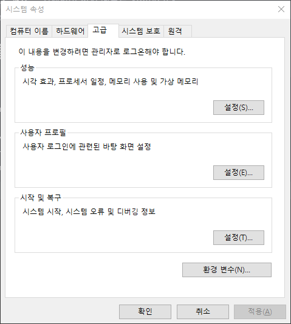
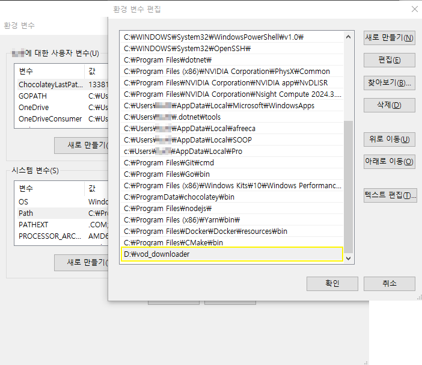
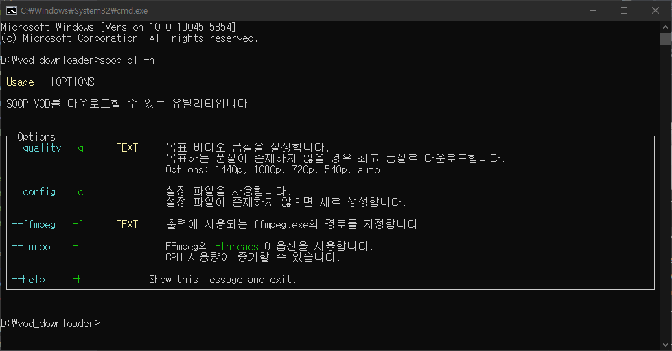
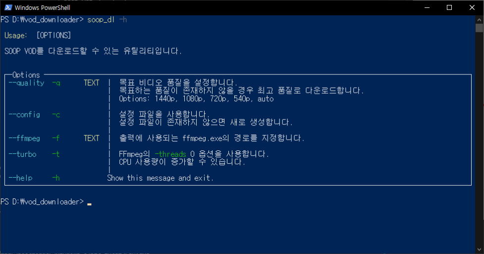

# SOOP VOD 다운로더

SOOP VOD를 다운로드하는 유틸리티 프로그램입니다.
윈도우 외의 실행 환경에서는 테스트되지 않았습니다.

개발자에게 메일 보내기 : [headonsilverplate@gmail.com](mailto:headonsilverplate@gmail.com)

## 다운로드


[여기](https://github.com/HO-Silverplate/SOOP-VOD-downloader/releases/latest)에서 최신 버전 빌드를 다운받을 수 있습니다.

## Prerequisites

- `FFmpeg Version 7.1`
>`FFmpeg` 마스터 브랜치 빌드는 오류가 발생하오니 꼭 릴리즈 빌드를 사용해 주시기 바랍니다.   

## 실행파일로 사용하기

`soop_dl.exe`가 위치한 폴더에서 `CMD` 또는 `PowerShell`로 명령어를 실행하세요.

```shell
soop_dl -h

soop_dl -c
# 설정 파일 사용하기

soop_dl -f '/path/to/ffmpeg.exe'
# ffmpeg 경로 지정하기

soop_dl -q 720p
# 720p 화질로 저장하기

soop_dl -c -q 720p -f '/path/to/ffmpeg.exe'
# 설정 파일 사용, 목표해상도 720p, FFmpeg 경로 갱신하기 

```

사용 가능한 옵션 플래그들은 `soop_dl -h`를 참고하세요.
> 빌드된 실행파일을 사용할 시 Python을 설치하지 않아도 실행이 가능합니다.

### Batch 모드 사용하기

`-b`플래그로 배치 모드를 사용할 수 있습니다.
배치 모드는 .txt 파일을 읽고, 해당 파일에 작성된 모든 URL에 대해 다운로드를 시도합니다.

배치 파일은 다음과 같이 작성해 주세요.

```text
https://vod.sooplive.co.kr/player/********
https://vod.sooplive.co.kr/player/********
https://vod.sooplive.co.kr/player/********
vod.sooplive.co.kr/player/********
https://vod.sooplive.co.kr/player/********
vod.sooplive.co.kr/player/********
...
```
모든 URL은 줄넘김으로 구분됩니다.

---

### PATH 등록

시스템 환경 변수에 `soop_dl`을 등록하면 명령어를 전역에서 실행할 수 있습니다.

먼저 `Windows`의 `고급 시스템 설정 > 고급 > 환경 변수` 설정 메뉴로 진입합니다.
또는 `시스템 환경 변수 편집`을 검색하여 진입할 수도 있습니다.


> 첨부된 이미지는 이해를 돕기 위한 예시입니다.

`환경 변수` 버튼을 눌러 설정 메뉴로 진입합니다.


> 첨부된 이미지는 이해를 돕기 위한 예시입니다.

`시스템 변수`에서 `Path`를 찾고 `편집`버튼을 눌러 편집 메뉴에 진입합니다.
`새로 만들기` 버튼을 클릭하고 `soop_dl.exe`가 위치한 폴더 위치를 입력합니다.
  
이제 `CMD` 또는 `PowerShell`에서 `soop_dl -h`을 실행하였을 때 다음과 같이 표시되면 정상적으로 처리된 것입니다.

|         `CMD`          |             `PowerShell`             |
| :--------------------: | :----------------------------------: |
|  |  |

## 소스코드로 사용하기

> 경고: 일반 사용자는 실행 파일을 이용해 주세요.

### 소스 코드 클론 및 환경 셋업

```shell
python --version
# python 3.13.4

git clone https://github.com/HO-Silverplate/SOOP-VOD-downloader.git
cd SOOP-VOD-downloader

python -m venv venv
venv/scripts/activate
pip install -r requirements.txt
```

코드 수정, 빌드, 실행을 위해 필요합니다.

```shell
python soop_dl.py
```

소스코드 실행은 파이썬 3.12 이상의 버전을 요구합니다.

### 패키징

실행 파일로 패키징하여 사용할 수 있습니다.

```shell
pyinstaller soop_dl.py --onefile --disable-windowed-traceback
```

실행 파일은 `/dist` 폴더에 저장됩니다.
