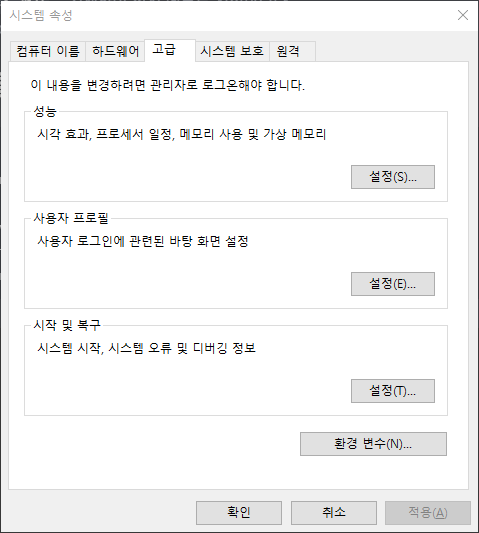
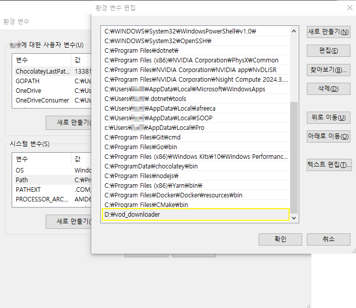
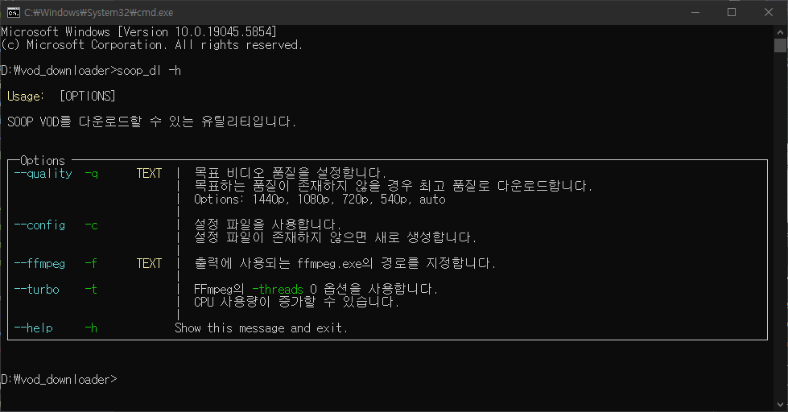
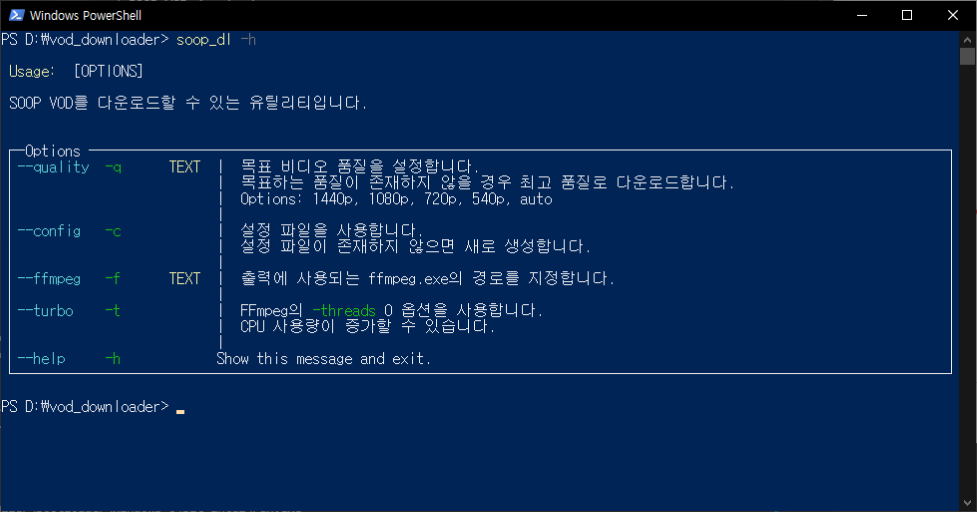

# SOOP VOD 다운로더

SOOP VOD를 다운로드하는 유틸리티 프로그램입니다.
윈도우 외의 실행 환경에서는 테스트되지 않았습니다.

개발자에게 메일 보내기 : [headonsilverplate@gmail.com](mailto:headonsilverplate@gmail.com)

#### [English](readme.en-US.md) / 한국어

### 다운로드


[여기](https://github.com/HO-Silverplate/SOOP-VOD-downloader/releases/latest)에서 최신 버전 빌드를 다운받을 수 있습니다.

### 현지화

언어 파일은 `assets/lang` 에 JSON 형식으로 저장됩니다.
기본 언어는 시스템 언어를 따르며, `--lang` 옵션으로 실행 시점에 오버라이드할 수 있습니다.

로케일을 인식하지 못하거나 해당 파일이 없으면 `en_US.json`을 기본으로 사용합니다.

```shell
python soop_dl.py --lang en_US
```

### 요구사항

- `FFmpeg`
>`FFmpeg` 릴리즈 빌드 사용을 권장합니다.   


### PATH 등록

시스템 환경 변수에 `soop_dl`을 등록하면 명령어를 전역에서 실행할 수 있습니다.

먼저 `Windows`의 `고급 시스템 설정 > 고급 > 환경 변수` 설정 메뉴로 진입합니다.
또는 `시스템 환경 변수 편집`을 검색하여 진입할 수도 있습니다.


> 첨부된 이미지는 이해를 돕기 위한 예시입니다.

`환경 변수` 버튼을 눌러 설정 메뉴로 진입합니다.


> 첨부된 이미지는 이해를 돕기 위한 예시입니다.

`시스템 변수`에서 `Path`를 찾고 `편집`버튼을 눌러 편집 메뉴에 진입합니다.
`새로 만들기` 버튼을 클릭하고 `soop_dl.exe`가 위치한 폴더 위치를 입력합니다.
  
이제 `CMD` 또는 `PowerShell`에서 `soop_dl -h`을 실행하였을 때 다음과 같이 표시되면 정상적으로 처리된 것입니다.

|         `CMD`          |             `PowerShell`             |
| :--------------------: | :----------------------------------: |
|  |  |


## 실행파일로 사용하기

`soop_dl.exe`가 위치한 폴더에서 `CMD` 또는 `PowerShell` 등으로 명령어를 실행하세요.

```shell
soop_dl -h
```
> 도움말
```shell
soop_dl -c
```
> 설정 파일 사용하기
```shell
soop_dl -f '/path/to/ffmpeg.exe'
```
> ffmpeg 경로 지정하기
```shell
soop_dl -q 720p
```
> 720p 화질로 저장하기
```shell
soop_dl -c -q 720p -f '/path/to/ffmpeg.exe'
```
> 설정 파일 사용, 목표해상도 720p, FFmpeg 경로 갱신하기 

```shell
soop_dl -c -q 720p -f '/path/to/ffmpeg.exe' -k 
```
> 설정 파일 사용, 목표해상도 720p, FFmpeg 경로 갱신, 임시파일 제거하지 않음 

---
기타 사용 가능한 옵션 플래그들은 `soop_dl -h`를 참고하세요.
> 빌드된 실행파일을 사용할 시 Python을 설치하지 않아도 실행이 가능합니다.

### Batch 모드 사용하기

```shell
soop_dl -c -b batch.txt
```
> 설정 파일 사용, 최고 품질, batch.txt에 기록된 파일부터 다운로드

`-b`플래그로 배치 모드를 사용할 수 있습니다.
배치 모드는 .txt 파일을 읽고, 해당 파일에 작성된 모든 URL에 대해 다운로드를 시도합니다.

배치 파일은 다음과 같이 작성해 주세요.

```text
https://vod.sooplive.com/player/********
https://vod.sooplive.com/player/********
https://vod.sooplive.com/player/********
vod.sooplive.com/player/********
https://vod.sooplive.com/player/********
vod.sooplive.com/player/********
...
```

모든 URL은 줄넘김으로 구분됩니다.

---

## 소스코드로 사용하기

> 경고: 일반 사용자는 실행 파일을 이용해 주세요.

### 요구사항

Python 3.12+

### 소스 코드 클론 및 환경 셋업

```shell
python --version

git clone https://github.com/HO-Silverplate/SOOP-VOD-downloader.git
cd SOOP-VOD-downloader

python -m venv venv
venv/scripts/activate
pip install -r requirements.txt
```

먼저 코드 수정/빌드/실행을 위해 Python 가상환경을 설정합니다.

```shell
python soop_dl.py
```

### 패키징

다음 명령어를 실행하여 프로그램을 패키징할 수 있습니다.

```shell
pyinstaller soop_dl.spec
```